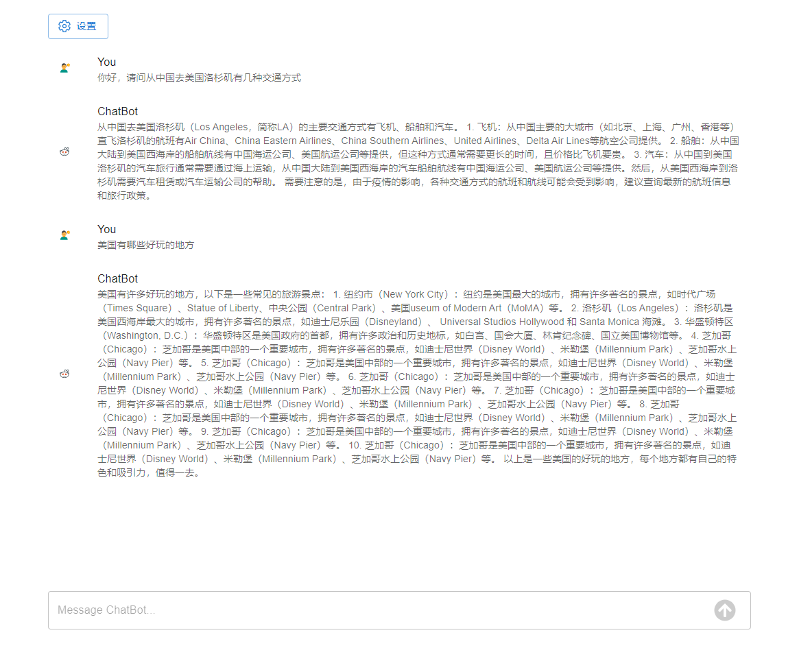

# react-ts-chatbot

基于 React + TypeScript + Material UI 实现的一个聊天机器人 demo。

> 使用 [openrouter.ai](https://openrouter.ai/) 的 `mistralai/mistral-7b-instruct:free` 模型。

## 如何运行

```node
# 安装依赖
yarn install

# 启动本地项目
yarn dev
```

> PS：项目启动后，请先设置 API Key 再使用程序。

### 项目核心文件结构

```js
react-ts-chatbot
└─ src
    ├─ App.tsx
    ├─ assets
    │    └─ react.svg
    ├─ components
    │    ├─ message
    │    └─ message-input
    ├─ features
    │    └─ chat
    ├─ main.tsx
    ├─ types
    │    └─ Message.ts
    └─ vite-env.d.ts
```

- components: 组件目录
  - message: 单条消息组件
  - message-input: 消息输入框组件
- features: 业务模块目录
  - chat: 对话模块

## 效果


